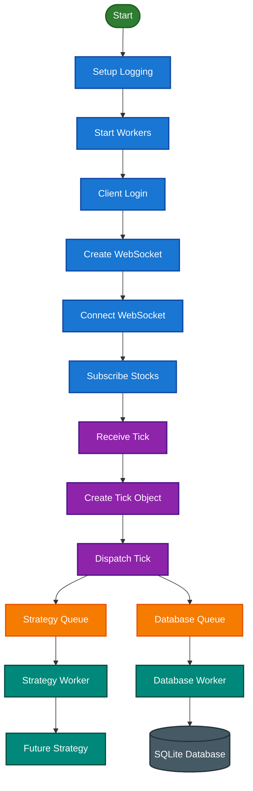
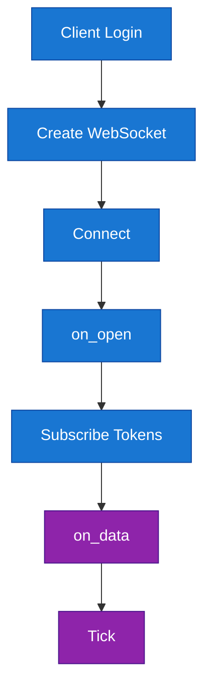
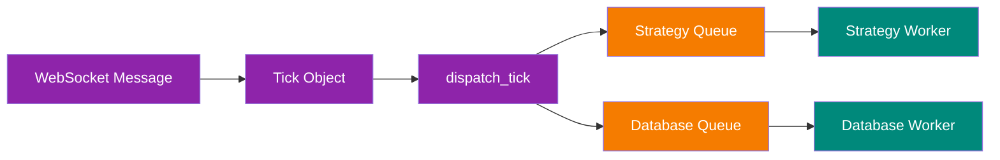
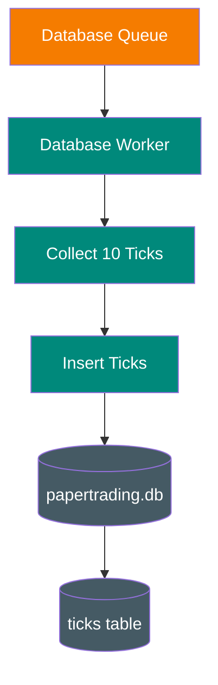
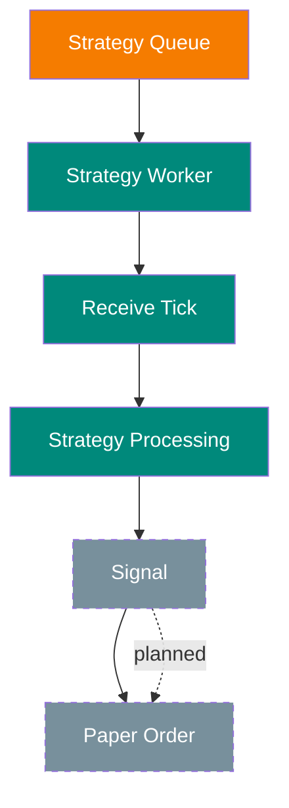
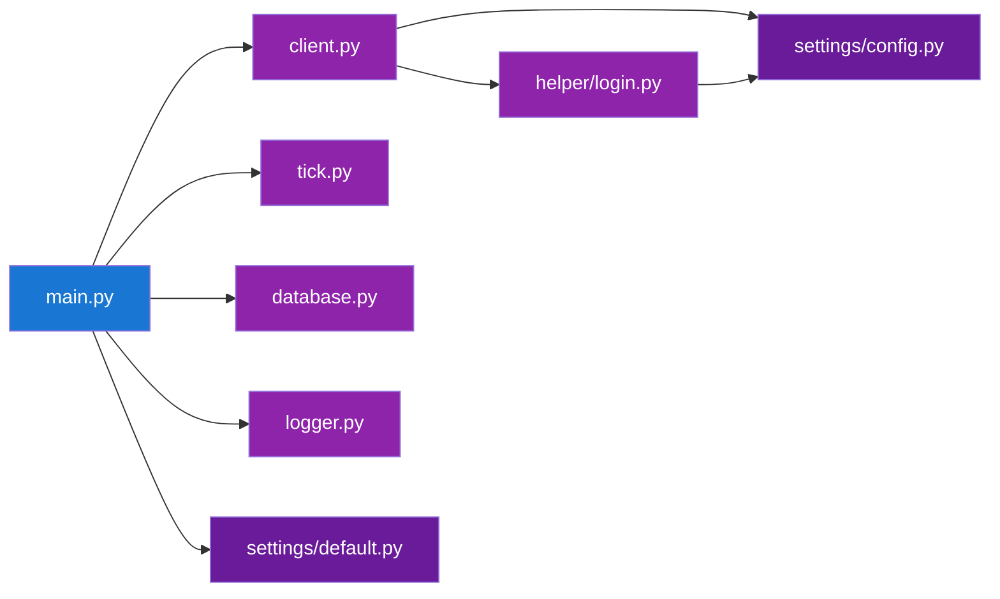
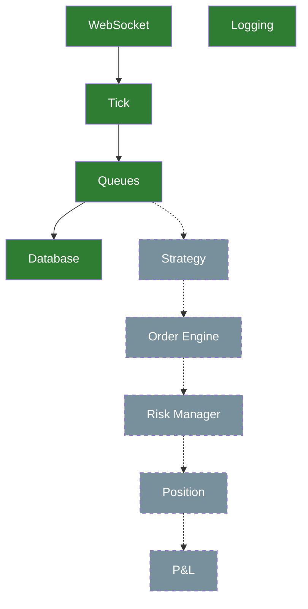

# PaperTrading Project Flow

This document shows the main flow of the current PaperTrading project in a simple way.

## 1. Main Flow



## 2. WebSocket Flow



## 3. Tick to Queue Flow



## 4. Database Flow



## 5. Strategy Flow — Current Skeleton



## 6. Project Modules



## 7. Current Project Status



## 8. Simple Summary

```text
SmartAPI
   ↓
WebSocket
   ↓
Tick
   ↓
dispatch_tick()
   ├── Strategy Queue
   │       ↓
   │   Strategy Worker
   │
   └── Database Queue
           ↓
       Database Worker
           ↓
        SQLite
```

The current uploaded project has the WebSocket, Tick, queue, database and logging parts. The actual strategy, order, risk, position and P&L logic is still planned/skeleton code.
