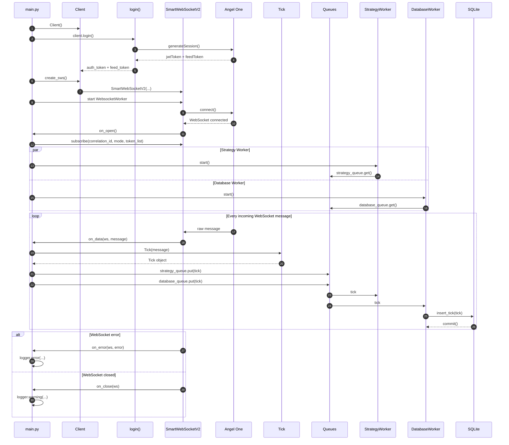
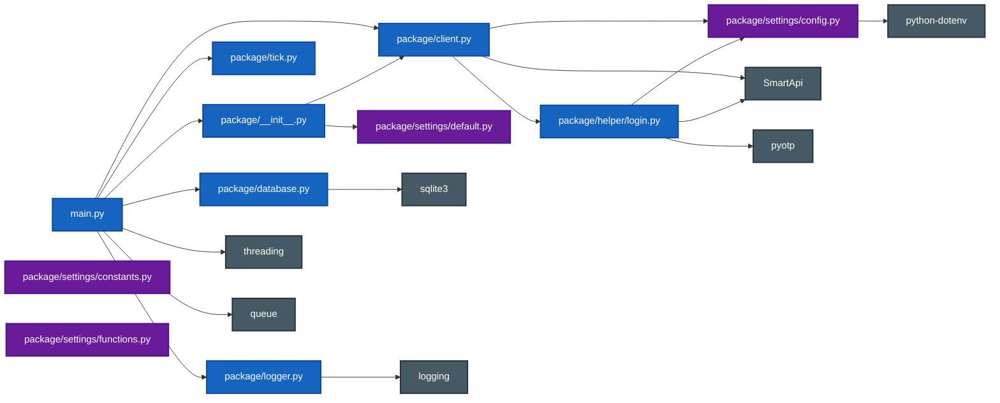
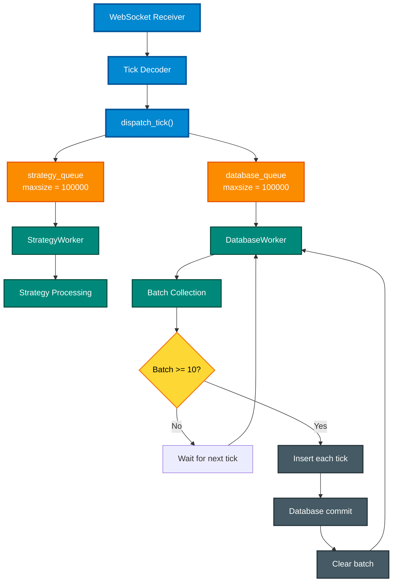
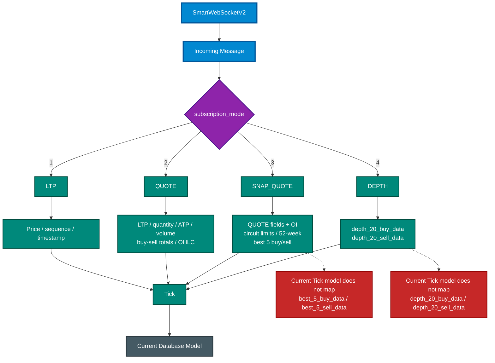
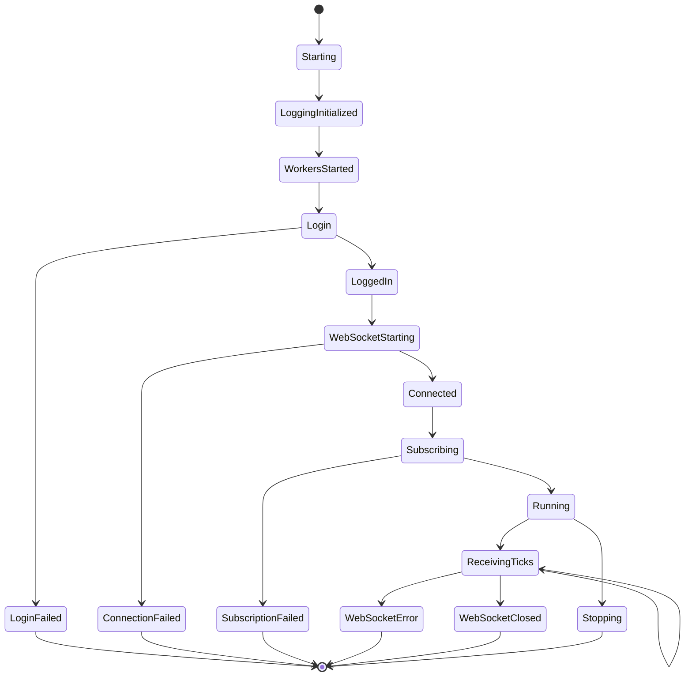
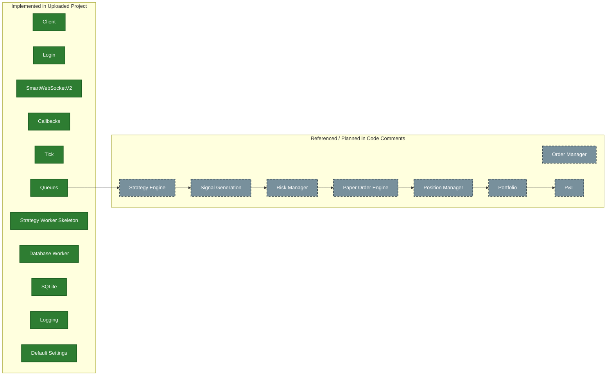

# PaperTrading — Expert Architecture

> This document models the current uploaded PaperTrading project. Implemented components are shown as the primary flow; components marked **planned** are not yet implemented in the uploaded code.

## 1. Complete System Architecture

```mermaid
flowchart TD

    %% ============================================================
    %% EXTERNAL / CONFIGURATION
    %% ============================================================

    ENV[".env / Environment Configuration"]
    SETTINGS["package.settings.default<br/>Default Trading Settings"]
    SMARTAPI["Angel One / SmartAPI"]

    ENV --> LOGINCFG["package.settings.config<br/>API_KEY / CLIENT_CODE / PIN / TOTP_SECRET"]
    SETTINGS --> MAINCFG["default_correlation_id<br/>default_mode<br/>default_token_list<br/>default_initial_balance<br/>default_daily_loss_limit"]

    %% ============================================================
    %% APPLICATION ENTRY
    %% ============================================================

    subgraph APP["Application Runtime"]
        MAIN["main.py<br/>main()"]
        LOG["package.logger<br/>Logging System"]

        MAIN --> LOG
    end

    LOGINCFG --> CLIENT
    MAINCFG --> MAIN

    %% ============================================================
    %% CLIENT / AUTHENTICATION
    %% ============================================================

    subgraph CLIENT_LAYER["Client & Authentication"]
        CLIENT["package.client.Client"]
        LOGIN["package.helper.login.login()"]
        SMARTCONNECT["SmartConnect"]
        TOKENS["Auth Token + Feed Token"]

        CLIENT --> LOGIN
        LOGIN --> SMARTCONNECT
        SMARTCONNECT --> TOKENS
        TOKENS --> CLIENT
    end

    MAIN --> CLIENT
    CLIENT --> LOGIN

    %% ============================================================
    %% WEBSOCKET
    %% ============================================================

    subgraph WS["WebSocket Layer"]
        CREATEWS["Client.create_sws()"]
        SWS["SmartWebSocketV2"]
        CONNECT["WebSocket Connect"]
        OPEN["on_open()"]
        SUBSCRIBE["subscribe(default_correlation_id,<br/>default_mode, default_token_list)"]
        DATA["on_data(ws, message)"]
        ERROR["on_error(ws, error)"]
        CLOSE["on_close(ws)"]

        CREATEWS --> SWS
        SWS --> CONNECT
        CONNECT --> OPEN
        OPEN --> SUBSCRIBE
        SWS --> DATA
        SWS --> ERROR
        SWS --> CLOSE
    end

    CLIENT --> CREATEWS
    SMARTAPI --> SWS

    %% ============================================================
    %% TICK DECODING
    %% ============================================================

    subgraph TICK_LAYER["Tick Processing"]
        RAW["Raw WebSocket Message"]
        TICK["package.tick.Tick"]
        VALID["Tick Object / Normalized Fields"]
        DISPATCH["dispatch_tick(tick)"]

        DATA --> RAW
        RAW --> TICK
        TICK --> VALID
        VALID --> DISPATCH
    end

    %% ============================================================
    %% SUBSCRIPTION MODES
    %% ============================================================

    subgraph MODES["Observed WebSocket Subscription Modes"]
        LTP["Mode 1 — LTP<br/>last_traded_price"]
        QUOTE["Mode 2 — QUOTE<br/>OHLC / volume / buy-sell totals"]
        SNAP["Mode 3 — SNAP_QUOTE<br/>OI / circuit / 52-week / best 5"]
        DEPTH["Mode 4 — DEPTH<br/>depth_20_buy_data / depth_20_sell_data"]
    end

    RAW --> LTP
    RAW --> QUOTE
    RAW --> SNAP
    RAW --> DEPTH

    LTP --> TICK
    QUOTE --> TICK
    SNAP --> TICK
    DEPTH --> TICK

    %% ============================================================
    %% IMPORTANT DATA GAP
    %% ============================================================

    SNAP --> LOSS1["Current Tick class does not store<br/>best_5_buy_data / best_5_sell_data"]
    DEPTH --> LOSS2["Current Tick class does not store<br/>depth_20_buy_data / depth_20_sell_data"]

    LOSS1 --> DATA_GAP["Data not persisted by current Tick/Database model"]
    LOSS2 --> DATA_GAP

    %% ============================================================
    %% QUEUES
    %% ============================================================

    subgraph QUEUES["In-Memory Queues"]
        SQ["strategy_queue<br/>Queue(maxsize=100000)"]
        DQ["database_queue<br/>Queue(maxsize=100000)"]
    end

    DISPATCH --> SQ
    DISPATCH --> DQ

    %% ============================================================
    %% STRATEGY WORKER
    %% ============================================================

    subgraph STRATEGY["Strategy Pipeline — Current Skeleton"]
        SW["strategy_worker()"]
        READS["Read Tick"]
        STRATEGY_ENGINE["Strategy Engine<br/>PLANNED"]
        SIGNAL["Signal<br/>PLANNED"]
        RISK["Risk Manager<br/>PLANNED"]
        ORDER["Paper Order Engine<br/>PLANNED"]

        SQ --> SW
        SW --> READS
        READS --> STRATEGY_ENGINE
        STRATEGY_ENGINE --> SIGNAL
        SIGNAL --> RISK
        RISK --> ORDER
    end

    %% ============================================================
    %% DATABASE WORKER
    %% ============================================================

    subgraph DATABASE["Database Pipeline"]
        DBW["database_worker()"]
        BATCH["Batch List<br/>BATCH_SIZE = 10"]
        DB["package.database.Database"]
        INSERT["insert_tick(tick)"]
        SQLITE[("database/papertrading.db")]
        TICKS[("ticks table")]

        DQ --> DBW
        DBW --> BATCH
        BATCH --> INSERT
        INSERT --> DB
        DB --> SQLITE
        SQLITE --> TICKS
    end

    %% ============================================================
    %% CURRENT DATABASE SCHEMA
    %% ============================================================

    subgraph SCHEMA["Current ticks Schema"]
        S1["subscription_mode"]
        S2["exchange_type"]
        S3["token"]
        S4["sequence_number"]
        S5["exchange_timestamp"]
        S6["last_traded_price"]
        S7["subscription_mode_val"]
        S8["last_traded_quantity"]
        S9["average_traded_price"]
        S10["volume_trade_for_the_day"]
        S11["total_buy_quantity"]
        S12["total_sell_quantity"]
        S13["open_price_of_the_day"]
        S14["high_price_of_the_day"]
        S15["low_price_of_the_day"]
        S16["closed_price"]
        S17["last_traded_timestamp"]
        S18["open_interest"]
        S19["open_interest_change_percentage"]
        S20["upper_circuit_limit"]
        S21["lower_circuit_limit"]
        S22["week_52_high_price"]
        S23["week_52_low_price"]
        S24["packet_received_time"]
        S25["created_at"]
    end

    TICKS --> S1
    TICKS --> S3
    TICKS --> S6
    TICKS --> S10
    TICKS --> S18
    TICKS --> S24
    TICKS --> S25

    %% ============================================================
    %% FUTURE TRADING DOMAIN
    %% ============================================================

    subgraph TRADING["Paper Trading Domain — Planned"]
        POS["Position Manager"]
        PORT["Portfolio"]
        PNL["P&L / Risk"]
        POS --> PORT
        PORT --> PNL
        ORDER --> POS
    end

    %% ============================================================
    %% LOGGING
    %% ============================================================

    subgraph LOGGING["Logging"]
        CONSOLE["Console Handler"]
        APPLOG["application.log<br/>Timed Rotation"]
        ERRLOG["error.log<br/>ERROR + CRITICAL"]

        LOG --> CONSOLE
        LOG --> APPLOG
        LOG --> ERRLOG
    end

    %% ============================================================
    %% THREADS
    %% ============================================================

    subgraph THREADS["Current Threads"]
        WT["WebsocketWorker<br/>daemon=True"]
        ST["StrategyWorker<br/>daemon=True"]
        DT["DatabseWorker<br/>daemon=True"]
    end

    MAIN --> WT
    MAIN --> ST
    MAIN --> DT

    WT --> CONNECT
    ST --> SW
    DT --> DBW

    %% ============================================================
    %% DIAGNOSTICS
    %% ============================================================

    subgraph DIAG["Diagnostics"]
        CHECK["check.py"]
        COUNT["SELECT COUNT(*) FROM ticks"]
        CHECK --> COUNT
        COUNT --> SQLITE
    end

    %% ============================================================
    %% STYLES
    %% ============================================================

    classDef entry fill:#1565C0,stroke:#0D47A1,color:#fff,stroke-width:3px;
    classDef config fill:#6A1B9A,stroke:#4A148C,color:#fff,stroke-width:2px;
    classDef external fill:#263238,stroke:#000,color:#fff,stroke-width:3px;
    classDef websocket fill:#0288D1,stroke:#01579B,color:#fff,stroke-width:2px;
    classDef tick fill:#8E24AA,stroke:#4A148C,color:#fff,stroke-width:2px;
    classDef queue fill:#FB8C00,stroke:#E65100,color:#fff,stroke-width:2px;
    classDef worker fill:#00897B,stroke:#004D40,color:#fff,stroke-width:2px;
    classDef database fill:#455A64,stroke:#263238,color:#fff,stroke-width:3px;
    classDef planned fill:#78909C,stroke:#37474F,color:#fff,stroke-width:2px,stroke-dasharray: 5 5;
    classDef warning fill:#C62828,stroke:#8E0000,color:#fff,stroke-width:2px;
    classDef logging fill:#546E7A,stroke:#263238,color:#fff,stroke-width:2px;
    classDef diagnostic fill:#5E35B1,stroke:#311B92,color:#fff,stroke-width:2px;

    class MAIN,CLIENT,MAINCFG entry;
    class ENV,LOGINCFG,SETTINGS,MAINCFG config;
    class SMARTAPI,SMARTCONNECT,SWS external;
    class CREATEWS,CONNECT,OPEN,SUBSCRIBE,DATA,ERROR,CLOSE,WT websocket;
    class RAW,TICK,VALID,DISPATCH,LTP,QUOTE,SNAP,DEPTH tick;
    class SQ,DQ queue;
    class SW,DBW,BATCH,READS,ST,DT worker;
    class DB,INSERT,SQLITE,TICKS database;
    class STRATEGY_ENGINE,SIGNAL,RISK,ORDER,POS,PORT,PNL planned;
    class LOSS1,LOSS2,DATA_GAP warning;
    class LOG,CONSOLE,APPLOG,ERRLOG logging;
    class CHECK,COUNT diagnostic;
```



---

## 2. Current Runtime Sequence



---

## 3. Module / Package Relationship



---

## 4. Worker / Queue Model



---

## 5. WebSocket Subscription Modes



---

## 6. Application Lifecycle



---

## 7. Current vs Planned Domain



---

## 8. Main Control Flow

```mermaid
flowchart TD

    START([main.py starts])

    START --> SETUP["setup_logging()"]
    SETUP --> WORKERS["Start worker threads"]

    WORKERS --> DBTHREAD["DatabaseWorker"]
    WORKERS --> STRTHREAD["StrategyWorker"]

    WORKERS --> LOGIN["Client.login()"]

    LOGIN --> CREATE["Client.create_sws()"]

    CREATE --> CALLBACKS["Assign callbacks"]

    CALLBACKS --> WSTHREAD["Start WebsocketWorker"]

    WSTHREAD --> CONNECT["sws.connect()"]

    CONNECT --> OPEN["on_open()"]

    OPEN --> SUBSCRIBE["sws.subscribe(...)"]

    SUBSCRIBE --> DATA["on_data()"]

    DATA --> TICK["Tick(message)"]

    TICK --> DISPATCH["dispatch_tick(tick)"]

    DISPATCH --> STRATEGY["strategy_queue"]
    DISPATCH --> DATABASE["database_queue"]

    STRATEGY --> STRWORKER["strategy_worker()"]
    DATABASE --> DBWORKER["database_worker()"]

    STRWORKER --> STRATEGY
    DBWORKER --> DATABASE

    WSTHREAD --> JOIN["ws_thread.join()"]

    JOIN --> STOP([Application stopped])

    classDef start fill:#2E7D32,stroke:#1B5E20,color:#fff,stroke-width:3px;
    classDef setup fill:#6A1B9A,stroke:#4A148C,color:#fff,stroke-width:2px;
    classDef ws fill:#0288D1,stroke:#01579B,color:#fff,stroke-width:2px;
    classDef data fill:#8E24AA,stroke:#4A148C,color:#fff,stroke-width:2px;
    classDef queue fill:#FB8C00,stroke:#E65100,color:#fff,stroke-width:2px;
    classDef worker fill:#00897B,stroke:#004D40,color:#fff,stroke-width:2px;
    classDef end fill:#455A64,stroke:#263238,color:#fff,stroke-width:3px;

    class START start;
    class SETUP,WORKERS,LOGIN,CREATE,CALLBACKS setup;
    class WSTHREAD,CONNECT,OPEN,SUBSCRIBE,DATA,JOIN ws;
    class TICK,DISPATCH data;
    class STRATEGY,DATABASE queue;
    class STRWORKER,DBWORKER worker;
    class STOP end;
```

---

## 9. Notes

### Current implementation

- `main.py` starts database and strategy daemon threads.
- `Client.login()` obtains authentication/feed tokens.
- `Client.create_sws()` creates `SmartWebSocketV2`.
- `on_open()` subscribes using the configured correlation ID, mode, and token list.
- `on_data()` creates a `Tick` and dispatches it to both queues.
- `database_worker()` batches 10 ticks before writing them.
- `strategy_worker()` currently logs/receives ticks but does not execute a real strategy.
- SQLite stores the current `ticks` schema.
- Logging has console, application-file, and error-file handlers.
- `check.py` counts rows in the `ticks` table.

### Current limitations visible from the code

- WebSocket error/close callbacks only log; reconnect/resubscribe logic is not implemented.
- `strategy_queue.put()` and `database_queue.put()` are blocking calls.
- Worker threads are daemon threads and run indefinitely; a graceful drain-and-close shutdown path is not implemented.
- The database `insert_tick()` commits each inserted tick, so the worker's batch list does not create one SQLite transaction for the entire batch.
- Mode 3 best-5 order-book fields and Mode 4 depth-20 fields are present in observed packet examples but are not represented in the current `Tick` class/database schema.
- Strategy, order, risk, position, portfolio, and P&L components are not implemented in the uploaded code.

